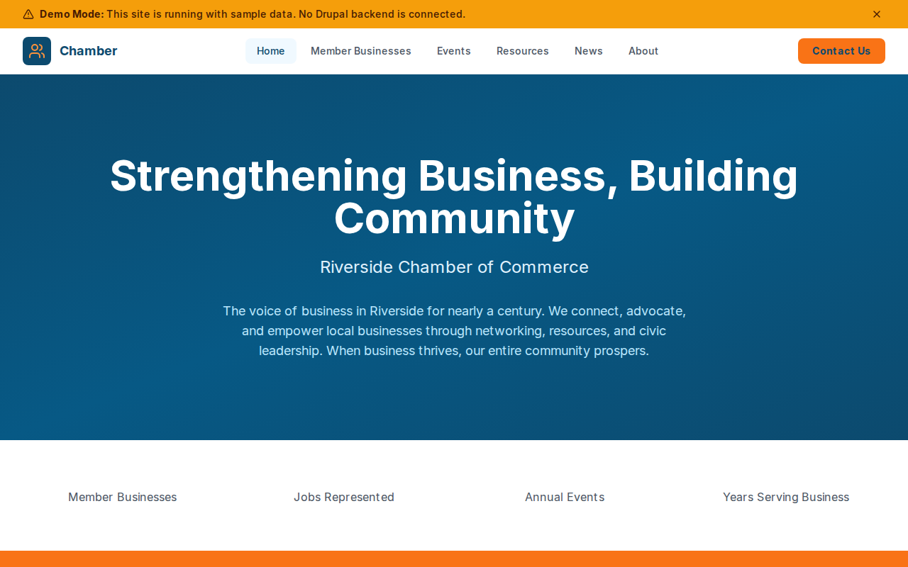

# Decoupled Chamber

A chamber of commerce website starter template for Decoupled Drupal + Next.js. Built for local chambers, business associations, trade organizations, and economic development groups.



## Features

- **Member Directory** - Searchable business listings with categories, contact info, and member profiles
- **Events** - Promote luncheons, networking mixers, awards galas, and workshops with registration links
- **Business Resources** - Guides for startups, advocacy updates, marketing toolkits, and member benefits
- **News** - Chamber news, press releases, and community announcements with featured articles
- **Modern Design** - Clean, accessible UI optimized for chamber of commerce content

## Quick Start

### 1. Clone the template

```bash
npx degit nextagencyio/decoupled-chamber my-chamber
cd my-chamber
npm install
```

### 2. Run interactive setup

```bash
npm run setup
```

This interactive script will:
- Authenticate with Decoupled.io (opens browser)
- Create a new Drupal space
- Wait for provisioning (~90 seconds)
- Configure your `.env.local` file
- Import sample content

### 3. Start development

```bash
npm run dev
```

Visit [http://localhost:3000](http://localhost:3000)

---

## Manual Setup

If you prefer to run each step manually:

<details>
<summary>Click to expand manual setup steps</summary>

### Authenticate with Decoupled.io

```bash
npx decoupled-cli@latest auth login
```

### Create a Drupal space

```bash
npx decoupled-cli@latest spaces create "My Chamber"
```

Note the space ID returned. Wait ~90 seconds for provisioning.

### Configure environment

```bash
npx decoupled-cli@latest spaces env 1234 --write .env.local
```

### Import content

```bash
npm run setup-content
```

This imports:
- Homepage with hero, stats (650+ member businesses, 15,000+ jobs represented, 75+ annual events, 95 years serving business), and membership CTA
- 4 member businesses: Riverstone Brewing Company, Summit Financial Advisors, Green Leaf Landscaping, Pixel Creative Agency
- 3 events: Monthly Business Luncheon, Business After Hours Mixer, Annual Business Excellence Awards Gala
- 3 resources: Starting a Business in Riverside, Legislative Advocacy & Policy Priorities, Member Marketing Toolkit
- 3 news articles: Small Business Week, Downtown Infrastructure Grant, Workforce Partnership Announcement
- 2 static pages: About the Chamber, Become a Member (with membership tiers)

</details>

## Content Types

### Member Business
- **business_category**: Industry category (e.g., "Food & Beverage", "Professional Services")
- **address**: Business street address
- **phone**: Contact phone number
- **website_url**: Business website link
- **member_since**: Year the business joined the chamber
- **image**: Business photo

### Chamber Event
- **event_date**: Event start date and time
- **end_date**: Event end date and time
- **location**: Venue name and address
- **ticket_price**: Pricing for members and non-members
- **registration_url**: Link to register or RSVP
- **image**: Event promotional image

### Business Resource
- **resource_category**: Category (Starting a Business, Advocacy, Marketing, etc.)
- **audience**: Target audience (Entrepreneurs, All Members, etc.)
- **image**: Resource illustration

### News Article
- **news_category**: Category (Events, Advocacy, Workforce, etc.)
- **publish_date**: Publication date
- **featured**: Whether the article is featured
- **image**: Featured image

### Homepage
- **hero_title**: Main headline (e.g., "Strengthening Business, Building Community")
- **hero_subtitle**: Organization name
- **hero_description**: Mission statement
- **stats_items**: Key statistics (members, jobs, events, years)
- **featured_items_title**: Section heading for upcoming events
- **cta_title / cta_description**: Membership call-to-action block

### Basic Page
- General-purpose static content pages (About, Join, etc.)

## Customization

### Colors & Branding
Edit `tailwind.config.js` to customize colors, fonts, and spacing.

### Content Structure
Modify `data/chamber-content.json` to add or change content types and sample content.

### Components
React components are in `app/components/`. Update them to match your design needs.

## Demo Mode

Demo mode allows you to showcase the application without connecting to a Drupal backend.

### Enable Demo Mode

```bash
NEXT_PUBLIC_DEMO_MODE=true
```

### Removing Demo Mode

1. Delete `lib/demo-mode.ts`
2. Delete `data/mock/` directory
3. Delete `app/components/DemoModeBanner.tsx`
4. Remove `DemoModeBanner` from `app/layout.tsx`
5. Remove demo mode checks from `app/api/graphql/route.ts`

## Deployment

### Vercel (Recommended)
[](https://vercel.com/new/clone?repository-url=https://github.com/nextagencyio/decoupled-chamber)

### Other Platforms
Works with any Node.js hosting platform that supports Next.js.

## Documentation

- [Decoupled.io Docs](https://www.decoupled.io/docs)
- [Next.js Documentation](https://nextjs.org/docs)
- [Drupal GraphQL](https://www.decoupled.io/docs/graphql)

## License

MIT
